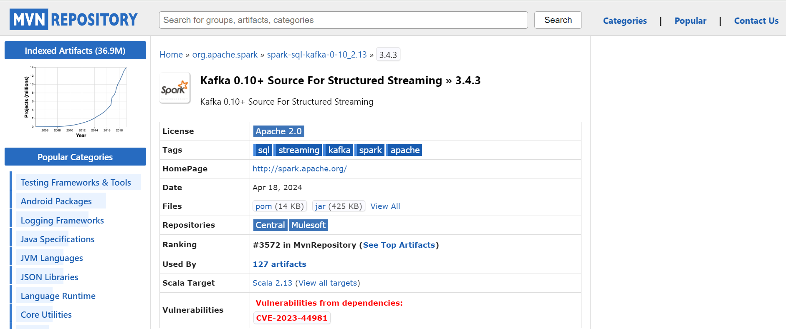

# How to connect Kafka and Pyspark in Windows

> [!IMPORTANT]
> Check the version compatibility between Kafka and Pyspark and their dependencies before starting connection.<br>
> Here I'm using, Pyspark v3.4.3, Hadoop v3.0.0, Kafka v2.7.0 and Scala v2.13.

**_Steps:_**
1. Install Pyspark.<br>
   Refer the link [Installing pyspark in windows](https://github.com/VarKar1012/Spark-installation-in-windows).
2. Install Kafka.<br>
   Refer the doc [Installing Kafka in windows](https://github.com/VarKar1012/Kafka-Pyspark-connection-in-Windows/blob/main/Connecting%20Kafka%20with%20Spark.docx)
3. Download required jar files to establish the connection from the Maven repository.
    1. Spark-sql-kafka integration jar: 
        [Download spark-sql-kafka jar](https://mvnrepository.com/artifact/org.apache.spark/spark-sql-kafka-0-10_2.13/3.4.3)
        * In the Maven repo: Click on the [jar] button in ‘Files’ menu to download.

          
          
    2. Kafka client jar:
        [Download kafka-client jar](https://mvnrepository.com/artifact/org.apache.kafka/kafka-clients/2.7.0)
    3. Commons-pool2 jar:
        [Download commons-pool2 jar](https://mvnrepository.com/artifact/org.apache.commons/commons-pool2/2.6.2)
> [!Note]
> Again, make sure the downloading versions are compatible.
> Pyspark v3.4.3, Kafka v2.7 and Commons-pool2 v2.6.2

4. Copy the jar files from downloaded location to the jar folder of Spark folder.<br>
  C:\apps\spark-3.4.3-bin-hadoop3-scala2.13\jars (<Pyspark_path>\jar).
5. To start the connection, open a new .ipynb file:
  * Create Spark Session and add kafka package to spark session config.
    ```
    packages = [
        "org.apache.spark:spark-sql-kafka-0-10_2.13:3.4.3",
        "org.apache.kafka:kafka-clients:2.7.0",
        "org.apache.commons:commons-pool2:2.6.2"
    ]

    # create spark session
    spark = SparkSession.builder\
        .appName('kafka_consumer')\
        .config("spark.jars.packages", ','.join(packages))\
        .getOrCreate()
    ```
  * Connect Spark streaming with Kafka topic to read data streams
    ```
    KAFKA_TOPIC = 'sample_topic'
    KAFKA_BOOTSTRAP_SERVER = 'localhost:9092'
    
    stream_df = spark.readStream\
        .format("kafka")\
        .option("kafka.bootstrap.servers", KAFKA_BOOTSTRAP_SERVER)\
        .option("subscribe", KAFKA_TOPIC)\
        .option("startingOffsets", "latest")\
        .load()
    ```
### This will enable streaming from Kafka to Pyspark if there are no other compatibility issues.
